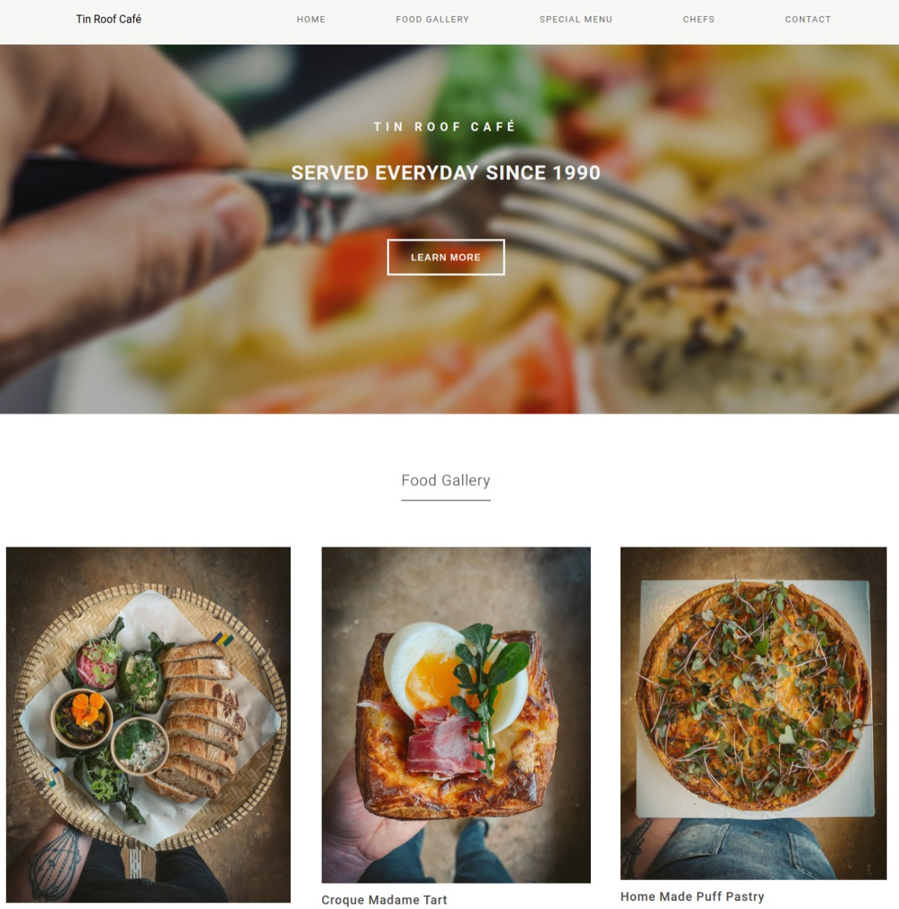

# Tin Roof Café
[Visit Now](https://ruperthnyagesoa.github.io/TinRoofCafé/) 🚀

&nbsp;

## Overview
Tin Roof Café site is restaurant website.
Made with basic HTML, CSS and JavaScript.

## Tech Stack
&nbsp;
&nbsp;

## Sneak Peek of Home Page 🙈 :

<h2>📬 Contact</h2>

If you want to contact me, you can reach me through below handles.

&nbsp;&nbsp;<a href="https://www.linkedin.com/in/ruperth-nyagesoa/"></img></a>

© 2022 Ruperth Nyagesoa

